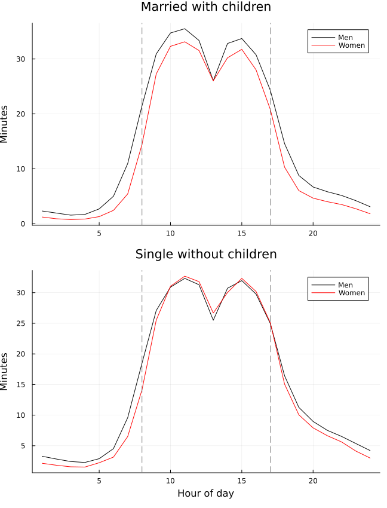

::: {.callout-note}

# Collegio Carlo Alberto Replication Project

This report was created as part of the assessment for the [`Computational Economics` Course](https://floswald.github.io/CompEcon/) in the PhD program at Collegio Carlo Alberto taught by [Florian Oswald](https://floswald.github.io/).

:::

## Paper and Replication Package

This report attempts a partial replication of Cubas, Juhn and Silos, "Coordinated Work Schedules and the Gender Wage Gap", using the `julia` computation language.

- Paper: <https://doi.org/10.1093/ej/ueac086>
- Replication package: <https://doi.org/10.5281/zenodo.7336171>
- Original software in the package: Stata and R
- Replication software used here: Julia

The replication targets are:

1. Table 1, Table 2 and Figure 2, the main descriptive exhibits.
2. Table 6, the main empirical wage-regression table.
3. Table 5, the simple model results.
4. Counterfactual 5.3.2, the quantitative-model counterfactual in which occupational coordination is set to the healthcare-support value.

At the current stage, Figure 2, Tables 1 and 2, Table 5 and the quantitative counterfactual are implemented and run in Julia. Tables 1 and 2 use the generated Stata checkpoint `5_data_#5.dta`, with the final regression and summary-statistic calculations performed in Julia. The final Julia code for Table 6 from Stata `.dta` checkpoints is also implemented, but the remaining Table 6 intermediate files still need to be generated.

## High Level Description of Computational Problem

The paper studies how coordinated work schedules affect the gender wage gap. The empirical part constructs time-use measures of work concentration during regular hours, especially an occupation-level `8-to-5` ratio, and relates those measures to gender gaps in work, household care, and wages. The main empirical tasks are therefore data construction from ATUS/CPS/ACS/O*NET sources and weighted regressions with demographic controls and occupation-level coordination measures.

The model part solves workers' time-allocation decisions across prime and non-prime hours. Workers choose labor in two time blocks, $l_1$ and $l_2$, while household care uses the remaining time. Effective labor in an occupation depends on total labor and a coordination penalty:

$$
\ell^* = l_1 + l_2 - (0.5 - l_1)^\alpha .
$$

The worker utility problem has the form

$$
U = c^\theta h^{1-\theta},
\qquad
h = \left(h_1^\xi + h_2^\xi\right)^{1/\xi},
$$

where $c = w \ell^*$, $h_1 = 0.5 - l_1$, and $h_2 = 0.5 - l_2$. The Julia code solves these nonlinear choice problems using numerical optimization, then iterates on wages until the general-equilibrium labor-market clearing conditions are satisfied.

The simple model behind Table 5 is a two-occupation version of this problem. The quantitative counterfactual uses the estimated parameters from `ces_param`, solves the baseline equilibrium, then sets every occupation's coordination parameter $\alpha$ equal to the healthcare-support occupation's value.

## Computational Requirements

The original replication package does not provide a single complete machine-readable requirements file. Inspection of the package shows that the original empirical exhibits rely on Stata scripts and the model results rely on R scripts.

For this Julia replication, the main package dependencies are:

- `DataFrames.jl` and `CSV.jl` for data handling.
- `XLSX.jl` for the Figure 2 checkpoint file.
- `Optim.jl` and `NLsolve.jl` for nonlinear optimization and equation solving.
- `Plots.jl` for Figure 2.
- `StatFiles.jl` for the planned `.dta` checkpoint route.

The generated Julia package exposes one main entry point:

```julia
using Pkg
Pkg.activate("CubasJuhnSilos")
using CubasJuhnSilos
CubasJuhnSilos.run_all()
```

Unit tests can be run with:

```bash
julia --project=CubasJuhnSilos -e 'using Pkg; Pkg.test()'
```

## Computational Setup

The replication was run locally with the following setup:

- Operating system: macOS 26.4.1.
- CPU: Apple M1.
- Cores: 8.
- Memory: 8 GB.
- Julia: 1.12.4.
- Quarto: 1.9.37.

The code and outputs are organized as follows:

- Julia package: `CubasJuhnSilos/`.
- Original replication files: `replication-package/`.
- Generated tables: `output/tables/`.
- Generated figures: `output/figures/`.
- Notes on missing inputs: `output/logs/`.

# Replication Results

## Figure 2

Figure 2 is replicated using the Stata-exported data checkpoint `fig2_3.xlsx`. This file contains the average minutes worked in each hour bin by gender and family status. The Julia code reads the spreadsheet and plots the two panels.

{#fig-figure2}

The replicated figure displays the same substantive pattern as the original: full-time workers concentrate work during regular daytime hours, with a larger male-female difference among married workers with children than among single workers without children.

## Table 5

Table 5 is replicated by porting the simple two-occupation model from R to Julia. The table below reports the main outputs produced by the Julia implementation.

| Panel A: No Gender Differences | Occupation 1 | Occupation 2 |
|---|---:|---:|
| Share of Workers | 0.479 | 0.521 |
| Ratio 8to5 | 0.595 | 0.506 |
| Earnings | 0.416 | 0.383 |
| Raw labor by occupation | 0.823 | 0.803 |
| Effective labor by occupation | 0.796 | 0.802 |

| Panel B: Gender-Specific $\nu$ | Occupation 1 | Occupation 2 |
|---|---:|---:|
| Gender Gap | 1.031 | 1.031 |
| Gender Gap, Occupation 2 | 1.005 | 1.005 |
| Share of Workers | 0.437 | 0.563 |
| Ratio 8to5 | 0.545 | 0.516 |
| Earnings | 0.459 | 0.356 |
| Raw labor by occupation | 0.910 | 0.730 |
| Effective labor by occupation | 0.898 | 0.726 |
| Share female | 0.000 | 0.888 |

| Panel C: Gender-Specific $\nu$ and Tastes | Occupation 1 | Occupation 2 |
|---|---:|---:|
| Aggregate Gender Gap | 1.026 | 1.026 |
| Gender Gap by Occupation | 1.047 | 1.005 |
| Ratio 8to5 | 0.599 | 0.510 |
| Share Female | 0.500 | 0.500 |
| Percent Workers | 0.497 | 0.503 |
| Earnings | 0.405 | 0.396 |
| Raw Labor | 0.823 | 0.804 |
| Effective Labor | 0.796 | 0.802 |

The corresponding output files are:

- `output/tables/table5_panel_a_no_gender.csv`
- `output/tables/table5_panel_b_gender_diff_nu.csv`
- `output/tables/table5_panel_c_tastes.csv`
- `output/tables/table5_replicated.tex`

## Counterfactual 5.3.2

The quantitative counterfactual is implemented in Julia by solving the baseline model and then setting all occupation-specific coordination parameters $\alpha$ equal to the healthcare-support occupation's value. This corresponds to `experiment == 1` in the original R script `main_ge.R`.

| Scenario | Aggregate gender gap (%) | Total log gap | Across log component | Within log component |
|---|---:|---:|---:|---:|
| Baseline | 9.626 | 0.092 | 0.019 | 0.073 |
| Same $\alpha$ as healthcare support | 6.464 | 0.063 | 0.042 | 0.020 |

The counterfactual substantially lowers the within-occupation component of the gender wage gap in the model, from 0.073 log points to 0.020 log points. This is consistent with the mechanism emphasized in the paper: coordination requirements amplify within-occupation gender wage differences.

The corresponding output files are:

- `output/tables/counterfactual_5_3_2_summary.csv`
- `output/tables/counterfactual_5_3_2_baseline_regression.csv`
- `output/tables/counterfactual_5_3_2_counter_regression.csv`

One caveat is important. The downloaded package does not include the original `Quantitative_Analysis/data/*.txt` calibration moment files used by the R script. The Julia implementation therefore uses the estimated parameters in `model_files/ces_param` and parses the labor shares from `latex_tables/table8.tex`. This is sufficient to solve the baseline and counterfactual equilibria, but it does not recompute the full original model-fit statistic.

## Tables 1 and 2

Tables 1 and 2 are replicated using the generated Stata checkpoint `5_data_#5.dta`. The Julia code follows the final Stata table script: it drops nonrespondents, restricts the sample to full-time married workers with children between ages 18 and 65, aggregates time-use bins to the respondent-day level, and estimates weighted least-squares regressions with ATUS final weights.

For speed, the Julia workflow first creates and uses a slim checkpoint, `5_data_#5_table12.dta`, containing only the variables needed for these two tables. This does not change the sample or calculations; it only avoids repeatedly loading hundreds of unused variables from the full two-gigabyte checkpoint file.

### Table 1: Work Hours

The coefficient reported is the female coefficient in regressions of total work hours. Negative values mean women report fewer work hours than comparable men in the selected sample.

| Model | Estimate | Standard error | Observations |
|---:|---:|---:|---:|
| 1 | -0.898 | 0.069 | 12,113 |
| 2 | -0.749 | 0.067 | 12,344 |
| 3 | -0.901 | 0.069 | 12,113 |
| 4 | -0.911 | 0.070 | 12,113 |
| 5 | -0.703 | 0.070 | 12,113 |
| 6 | -0.490 | 0.077 | 8,393 |

### Table 2: Household Care Hours

The coefficient reported is the female coefficient in regressions of total household-care hours. Positive values mean women report more household-care hours than comparable men in the selected sample.

| Model | Estimate | Standard error | Observations |
|---:|---:|---:|---:|
| 1 | 0.436 | 0.028 | 12,113 |
| 2 | 0.264 | 0.033 | 12,344 |
| 3 | 0.436 | 0.028 | 12,113 |
| 4 | 0.349 | 0.027 | 12,113 |
| 5 | 0.319 | 0.027 | 12,113 |
| 6 | 0.266 | 0.033 | 8,393 |

The corresponding weighted means are:

| Statistic | Weighted mean |
|---|---:|
| Weekday male work | 7.904 |
| Weekday female work | 7.006 |
| Weekend male work | 2.163 |
| Weekend female work | 1.414 |
| Weekday male household care | 0.821 |
| Weekday female household care | 1.257 |
| Weekend male household care | 1.002 |
| Weekend female household care | 1.267 |

The corresponding output files are:

- `output/tables/table1_from_dta.csv`
- `output/tables/table2_from_dta.csv`
- `output/tables/tables1_2_weighted_means_from_dta.csv`

## Table 6

The original Stata script for Table 6 expects additional intermediate `.dta` files. The Julia package contains a checkpoint route that will read these `.dta` files once they are produced and then replicate the final wage-regression table in Julia. The commands are:

```julia
CubasJuhnSilos.run_table1_table2(source = :dta)
CubasJuhnSilos.run_table6(source = :dta)
```

A raw-data port is also scaffolded:

```julia
CubasJuhnSilos.run_table1_table2(source = :raw)
CubasJuhnSilos.run_table6(source = :raw)
```

The remaining Table 6 checkpoint files are:

- `replication-package/Codes_CubasJuhnSilos/EJ_replicate/document_data_new/document_dta/6_regression data/6_b_reg.dta`
- `replication-package/Codes_CubasJuhnSilos/EJ_replicate/table6-7/ONET_563b.dta`
- `replication-package/Codes_CubasJuhnSilos/EJ_replicate/table6-7/bratio_563all.dta`

These files are generated by the Stata scripts in `document_data_new/document_dta/6_regression data/`, `table4/`, and `table6-7/`. Once they are available, `CubasJuhnSilos.run_table6(source = :dta)` will write `output/tables/table6_from_dta.csv`.

# Conclusion

This replication currently reproduces Figure 2, Tables 1 and 2, the model-based Table 5, and the quantitative counterfactual in Julia. The main remaining task is Table 6: generating the remaining Stata checkpoint datasets and then running the implemented Julia checkpoint route for the final wage regressions.
